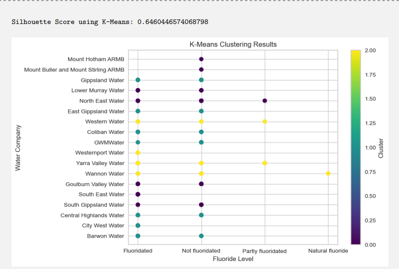

# 🧠 Machine Learning: Analyzing Water Fluoridation Data in Victoria  

Welcome to my **Machine Learning project**! This project analyzes water fluoridation data across various suburbs in Victoria, Australia, using clustering techniques and visualization to uncover patterns and insights.  

## 🌟 Highlights  

- **📊 Data Analysis**: Explored patterns in water fluoridation levels and their distribution across suburbs.  
- **🔍 Clustering**: Performed clustering using K-Means, K-Means++, and DBSCAN to classify water companies based on fluoridation levels.  
- **📈 Visualization**: Created insightful charts, histograms, and maps to visualize the results effectively.  
- **📊 Comparative Analysis**: Evaluated clustering methods using Silhouette Scores to identify the best-performing model.  

## 🛠️ Key Objectives  

1. Analyze the dataset dimensions, feature types, and unique values.  
2. Determine patterns and ratios in fluoridation levels.  
3. Cluster water companies based on their fluoridation attributes using:  
   - **K-Means**  
   - **K-Means++**  
   - **DBSCAN**  
4. Evaluate and compare clustering methods for optimal results.  

## 📚 The Dataset  

The dataset includes fluoridation data from various suburbs in Victoria, sourced from the [Victorian Government Open Data Portal](https://discover.data.vic.gov.au/dataset/victorian-water-fluoridation-status-by-postcode). It contains the following attributes:  

- **Location Data**: Suburb, latitude, longitude, postcode  
- **Fluoridation Levels**: Categories such as Fluoridated, Not Fluoridated, Partly Fluoridated, and Natural Fluoride  
- **Other Attributes**: Melbourne inclusion flag, water company names  

## 🔬 Analytical Insights  

- **Suburb Fluoridation Patterns**:  
  Most suburbs have a single water company, but a few, such as Armadale and Malvern, have more.  

- **Top Suburbs for Fluoridated Companies**:  
  Suburbs like Armadale and Bayswater lead with the highest number of fluoridated water companies.  

- **Clustering Performance**:  
  - **K-Means**: Silhouette Score = 0.646  
  - **K-Means++**: Silhouette Score = 0.663  
  - **DBSCAN**: Silhouette Score = **0.999**, showcasing exceptional clustering accuracy.  

## 📈 Visualizations  

- **Fluoride Level Distribution**: Bar charts and histograms showing fluoride level ratios.  
- **Clustering Results**: Color-coded scatter plots for each clustering method.  
- **Top Suburbs Analysis**: Histograms of the top 10 suburbs based on fluoridated companies. 

## 📸 Screenshots  

Take a glimpse of the work:  

  
  
  

## 💡 Why This Matters  

This project demonstrates the application of machine learning and data analysis techniques to address real-world public health challenges. It highlights:  

- 🚀 The power of unsupervised learning to uncover patterns in data.  
- 🌍 The importance of data visualization in decision-making.  
- 📊 The role of clustering in identifying group characteristics and improving interventions.  

## 📁 Repository Contents  

- **Code Notebook**: Python `.ipynb` file with all steps, explanations, and outputs.  
- **Data**: The preprocessed dataset used for analysis.  
- **Results**: Visualizations, clustering performance metrics, and findings.  

## 📬 Contact  

Explore, contribute, or connect! For inquiries or feedback, reach out to me at [sathiyanarayanan.s1698@gmail.com](mailto:sathiyanarayanan.s1698@gmail.com). 

---

If you find this project valuable, don’t forget to ⭐ star the repository! Let's collaborate and explore the wonders of data science together.  
